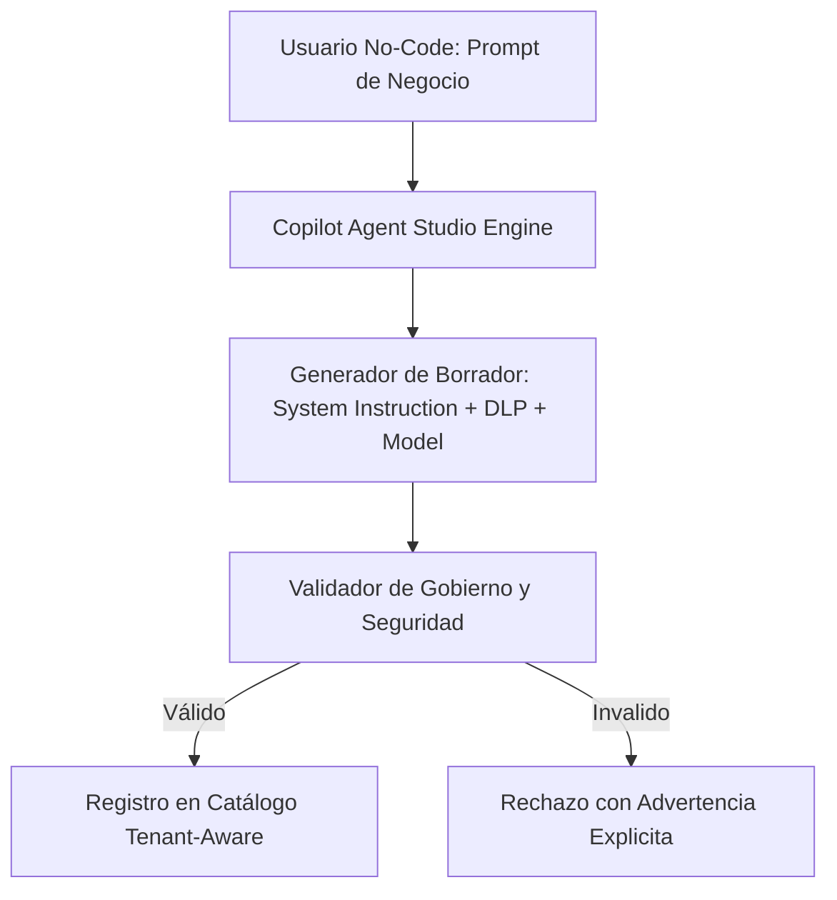

# Arquitectura de Agent Studio — Flentio Platform

El módulo **Agent Studio** permite la generación, validación, gobierno y registro de **Agentes de IA Especializados** mediante interfaces no-code asistidas por el Copiloto o mediante configuraciones visuales.

---

## 1. Componentes Principales

- **Compilador No-Code desde Prompt**: Convierte solicitudes en lenguaje natural en especificaciones estructuradas con DLP obligatorio y citas `[E#]`.
- **Motor de Validación Determinista**: Garantiza que ningún agente se registre sin protección DLP, aislamiento RLS ni modelo generativo autorizado.
- **Registro Tenant-Aware**: Persiste la definición del agente bajo el esquema del tenant autenticado.

---

## 2. Diagrama de Flujo

