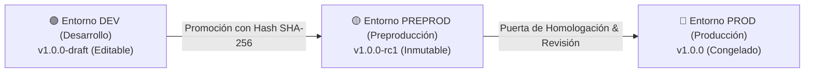

# Arquitectura de Entornos (DEV / PREPROD / PROD) y Versionado Inmutable — Flentio Platform

Este documento define la arquitectura para la gestión del ciclo de vida de entornos y control de versiones inmutables para flujos y agentes especializados en **Flentio Platform**.

---

## 1. Ciclo de Vida de Entornos

---

## 2. Reglas Invariables de Inmutabilidad
1. **Edición Restringida**: Ningún flujo o agente en `PREPROD` o `PROD` puede editarse directamente. Toda modificación requiere clonar un borrador hacia `DEV`.
2. **Hash de Integridad SHA-256**: Cada versión promovida calcula un hash SHA-256 de la definición completa. Si el contenido cambia, el hash cambiará e invalidará la promoción.
3. **Auditoría Append-Only**: Cada cambio de entorno emite un registro inmutable en `flentio_platform.audit_logs`.
