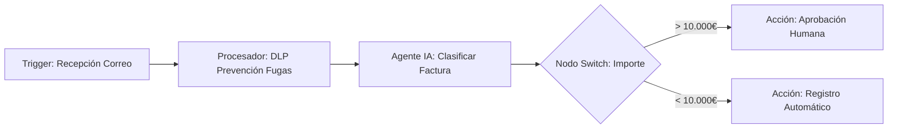

# MANUAL DE USUARIO COMPLETO Y EXPLICATIVO — FLENTIO PLATFORM (v1.0.0)

> **Dirigido a:** Analistas, operadores, administradores de procesos, investigadores operacionales y usuarios de negocio.  
> **Filosofía:** No-Code First (Sin necesidad de programar ni escribir código técnico).

---

## ÍNDICE GENERAL

1. [Módulo 1: Visión General y Filosofía del Sistema](#módulo-1-visión-general-y-filosofía-del-sistema)
2. [Módulo 2: Interfaz Principal y Navegación](#módulo-2-interfaz-principal-y-navegación)
3. [Módulo 3: Diseñador Visual de Flujos e IA Copiloto](#módulo-3-diseñador-visual-de-flujos-e-ia-copiloto)
4. [Módulo 4: Catálogo Completo de Nodos No-Code](#módulo-4-catálogo-completo-de-nodos-no-code)
5. [Módulo 5: Bóveda de Credenciales y Gobierno de Accesos](#módulo-5-bóveda-de-credenciales-y-gobierno-de-accesos)
6. [Módulo 6: Agentes de IA y Base de Conocimiento RAG](#módulo-6-agentes-de-ia-y-base-de-conocimiento-rag)
7. [Módulo 7: Centro de Investigaciones Operacionales e Incidentes](#módulo-7-centro-de-investigaciones-operacionales-e-incidentes)
8. [Módulo 8: Cuadros de Mando y Estado Operativo](#módulo-8-cuadros-de-mando-y-estado-operativo)
4. **Citas de Evidencia Obligatorias `[E#]`**: Cuando los Agentes de IA responden a consultas sobre documentos de tu empresa, siempre incluyen identificadores de cita legibles (ej. `[E1]`, `[E2]`) que te permiten ver exactamente de qué página y documento procede la información.

---

## MÓDULO 2: INTERFAZ PRINCIPAL Y NAVEGACIÓN

```text
┌─────────────────────────────────────────────────────────────────────────────┐
│ 🟦 FLENTIO PLATFORM   [Tenant: MiOrganización]     [👤 Usuario / Rol]       │
├───────────────────┬─────────────────────────────────────────────────────────┤
│ 📌 Menú Principal  │  📊 Panel Central de Trabajo                            │
│ ───────────────── │  ─────────────────────────────────────────────────────  │
│ 🏠 Inicio / Dash  │  🤖 ¿Qué deseas automatizar hoy?                        │
│ ⚡ Mis Flujos     │  [ Escribe en lenguaje natural...           ] [ 🪄 Crear] │
│ 📚 Conocimiento   │                                                         │
│ 🔍 Investigaciones│  📈 Cuadro Ejecutivo de Estado                           │
│ 🔐 Credenciales   │  ┌───────────────┐ ┌───────────────┐ ┌───────────────┐  │
│ ⚙️ Administración │  │ Flujos: 12    │ │ RAG: Activo   │ │ Alertas: 0    │  │
│                   │  └───────────────┘ └───────────────┘ └───────────────┘  │
└───────────────────┴─────────────────────────────────────────────────────────┘
```

### 2.1 Barra Superior y Selector de Organización
- **Identificador de Tenant**: Muestra la organización activa. Todas las búsquedas y automatizaciones aplicarán únicamente al contexto de esa entidad.
- **Perfil de Usuario**: Muestra tu identidad, rol asignado (ej. `admin`, `operador`, `auditor`) y nivel de confidencialidad.

### 2.2 Panel Lateral de Navegación
- **Inicio / Dashboard Ejecutivo**: Vista agregada de actividad, incidentes y salud de integraciones.
- **Mis Flujos**: Galería de automatizaciones creadas, plantillas corporativas y estado de ejecución (Activo / Inactivo).
- **Conocimiento (RAG)**: Gestión de documentos corporativos (PDF, DOCX, TXT), ingesta, cuarentena de seguridad y buscador con IA.
- **Investigaciones**: Centro de gestión de incidentes, correlación de datos operacionales y runbooks de resolución.
- **Bóveda de Credenciales**: Gestión no-técnica de claves y accesos a aplicaciones externas (Gmail, Slack, PostgreSQL, etc.).

### Conectar Gemini sin API key personal

En la **Bóveda de Credenciales**, seleccione **Google Gemini (OAuth recomendado)**, asigne un nombre y pulse **Conectar con Google para Gemini**. Google muestra el consentimiento y Flentio almacena cifrado el refresh token bajo el propietario; la contraseña y los tokens nunca se muestran en la aplicación. El nodo **IA Gemini** acepta esta credencial y renueva automáticamente los access tokens.

Flentio solicita únicamente `generative-language.retriever`, el alcance específico documentado para credenciales Gemini. El proyecto Google Cloud, su cuota y facturación los configura el administrador. Si la aplicación OAuth o Generative Language API no están disponibles, la conexión muestra `GEMINI_OAUTH_NO_CONFIGURADO` y no se simula. La API key continúa disponible como alternativa.

---

## MÓDULO 3: DISEÑADOR VISUAL DE FLUJOS E IA COPILOTO

### 3.1 Tres Formas de Crear un Flujo

#### Opción 1: Generación con Inteligencia Artificial (Recomendada)
1. En la caja principal de texto del Dashboard, describe lo que deseas lograr:
   > *"Cada vez que llegue una factura en PDF por correo, escanéala con IA y envía un resumen a Slack"*
2. Haz clic en **🪄 Generar Flujo**. El copiloto creará la estructura completa de nodos interconectados.
3. Si la IA necesita aclarar algún parámetro (ej. el canal de Slack), te presentará **chips de respuesta rápida**.

#### Opción 2: Desde una Plantilla Corporativa
1. Haz clic en **Plantillas**.
2. Filtra por categoría: *Bancario*, *Medical (Healthcare)*, *Corporativo Neutro*, *Operaciones SRE*, *Notificaciones*.
3. Pulsa **Usar Plantilla** para abrir el flujo listo para personalizar.

#### Opción 3: Flujo en Blanco
1. Haz clic en **+ Nuevo Flujo**.
2. Asigna un nombre claro y una categoría de negocio.

---

### 3.2 El Lienzo Gráfico de Automatización



#### Operaciones en el Lienzo:
- **Añadir Nodos**: Haz doble clic en cualquier zona vacía del lienzo para abrir el selector de nodos visual.
- **Conectar Nodos**: Arrastra un conector desde la salida de un bloque (punto derecho) hasta la entrada del siguiente (punto izquierdo).
- **Asistente de Variables `{{ }}`**: En los campos de configuración de un nodo, escribe `{{` para desplegar un menú contextual con los datos devueltos por nodos anteriores.

---

## MÓDULO 4: CATÁLOGO COMPLETO DE NODOS NO-CODE

### 4.1 Bloques de Activación (Triggers)
- **Webhook Entrante**: Recibe eventos en tiempo real desde aplicaciones externas mediante una URL segura.
- **Programador Cron / Temporizador**: Ejecuta el flujo en horarios específicos (ej. *"Todos los días a las 09:00 AM"*).
- **Receptor de Correo IMAP**: Monitoriza buzones corporativos buscando correos o adjuntos específicos.

### 4.2 Bloques de Procesamiento e Inteligencia
- **Agente IA Conversacional**: Razona y toma decisiones basadas en reglas o prompts de lenguaje natural.
- **Protección DLP (Prevención de Fugas)**: Detecta y enmascara automáticamente tarjetas bancarias, IBAN, DNI o secretos antes de llamar a modelos externos.
- **Evaluador de Conocimiento RAG**: Consulta la documentación corporativa y extrae evidencias trazables con citas `[E#]`.
- **Selector Lógico (Switch)**: Divide el camino del flujo según condiciones de negocio (ej. por importe, prioridad o tipo de cliente).
- **Filtro de Contenido**: Detiene la ejecución si los datos no cumplen ciertos criterios definidos.
- **Visión IA (Próximamente)**: Extracción estructural de información a partir de diagramas y radiografías DICOM para inyectarlos al RAG.
- **Remediación Autónoma (Próximamente)**: Interceptor lógico que emite scripts de auto-curación de infraestructura para su firma electrónica.

### 4.3 Bloques de Acción y Emisión
- **Enviador Gmail / SMTP**: Envía correos formateados con soporte para archivos adjuntos.
- **Notificador Slack / Teams**: Publica mensajes y alertas en canales o chats privados.
- **Base de Datos SQL Gobernada**: Ejecuta consultas de lectura o inserción parametrizadas sin permitir comandos destructivos no confirmados.

---

## MÓDULO 5: BÓVEDA DE CREDENCIALES Y GOBIERNO DE ACCESOS

```text
┌─────────────────────────────────────────────────────────────────────────┐
│ 🔐 BÓVEDA DE CREDENCIALES                     [+ Nueva Credencial]      │
├─────────────────────────────────────────────────────────────────────────┤
│ Nombre               │ Servicio     │ Estado           │ Acciones       │
│ ─────────────────────┼──────────────┼──────────────────┼─────────────── │
│ Gmail Facturación    │ Gmail OAuth  │ 🟢 Configurado   │ [Probar] [Editar]│
│ Slack Alertas SRE    │ Slack Webhook│ 🟢 Configurado   │ [Probar] [Editar]│
│ DB Transacciones     │ PostgreSQL   │ ⚙️ Conf. Requerida│ [Configurar]   │
└─────────────────────────────────────────────────────────────────────────┘
```

### 5.1 Configuración No-Técnica de Servicios
- **Formularios Guiados**: Para conectar un servicio como Gmail o Slack, no necesitas manipular ficheros de configuración. La interfaz te guiará mediante un asistente paso a paso.
- **Cifrado Fuerte (AES-256-GCM)**: Todas las contraseñas y claves guardadas en la bóveda se cifran inmediatamente.
- **Prueba de Conexión en Un Clic**: Antes de guardar una credencial, el botón **Probar Conexión** verifica que los accesos sean correctos.

### 5.2 Perfiles de Gobierno Dinámico
Tu administrador puede asignar perfiles de gobierno a la organización:
- **Perfil BANKING_ENTERPRISE**: Máxima exigencia. Requiere revisión DLP estricta y desactiva el uso de servicios no homologados.
- **Perfil EXPRESS**: Mayor agilidad operacional manteniendo el aislamiento RLS por tenant.

---

## MÓDULO 6: AGENTES DE IA Y BASE DE CONOCIMIENTO RAG

### 6.1 Ingesta Segura de Documentos

1. Navega a **Conocimiento (RAG)**.
2. Haz clic en **Subir Documentos** (Soporta PDF con capa de texto, DOCX y TXT hasta 15 MB).
3. **Escaneo Antivirus Automático (ClamAV)**: El archivo es analizado en tiempo real. Si contiene malware o anomalías, pasará a estado de **Cuarentena** con notificación a seguridad.
4. **Validación de Prompt Injection**: Si el documento contiene instrucciones manipuladas destinadas a engañar a la IA, quedará retenido en cuarentena para aprobación humana segregada.

---

### 6.2 Búsqueda de Evidencias y Citas `[E#]`

Cuando los Agentes de IA responden a tus preguntas sobre la base de conocimiento:
- Cada afirmación está respaldada por una cita explícita (ej. `[E1]`, `[E2]`).
- Al hacer clic en la cita `[E#]`, se desplegará el **visor de evidencia**, mostrando el fragmento exacto del documento original, su fecha de captura, vigencia y nivel de clasificación.
- Si no hay suficiente información autorizada en la base de datos, el sistema declarará explícitamente **Evidencia Insuficiente / `SIN_DATOS`** en lugar de especular.

```text
[Respuesta de IA]: Las transferencias SEPA inmediatas deben procesarse en menos de 10 segundos [E1].

┌─ Visor de Cita [E1] ──────────────────────────────────────────────────┐
│ Documento: Normativa_Pagos_SEPA_2026.pdf (Página 12)                  │
│ Clasificación: INTERNAL | Retención: GOVERNANCE                       │
│ Fragmento: "El plazo máximo de ejecución para operaciones SEPA Inst..."│
└───────────────────────────────────────────────────────────────────────┘
```

---

## MÓDULO 7: CENTRO DE INVESTIGACIONES OPERACIONALES E INCIDENTES

### 7.1 Correlación Automática de Incidentes
El módulo de Investigaciones permite auditar fallos operacionales en servicios o infraestructura:
- Agrupa eventos relacionados, logs y cambios recientes en un **Expediente Gobernado**.
- Asigna un nivel de severidad (Crítica, Alta, Media, Baja).

### 7.2 Runbooks de Remediación Segura
- Para cada incidente, el sistema presenta **Runbooks Operables**.
- **Seguridad Antierror**: Ninguna acción destructiva o de remediación se ejecuta de forma autónoma sin la confirmación explícita y motivada de un operador autorizado.

---

## MÓDULO 8: CUADROS DE MANDO Y ESTADO OPERATIVO

De acuerdo con el **Estándar de Dashboard de Flentio**, toda capacidad tiene representación visual:

| Indicador de Estado | Significado para el Usuario |
|---|---|
| 🟢 **OPERATIVO** | El servicio o integración funciona correctamente y ha sido verificado. |
| ⚙️ **NO_CONFIGURADO** | Falta una credencial o dependencia. La interfaz muestra un enlace directo para configurarla. |
| 📭 **SIN_DATOS** | La consulta es válida pero no existen registros en la ventana de tiempo seleccionada. |
| ⚠️ **NO_DISPONIBLE** | El servicio externo o proveedor tuvo una interrupción. Muestra la última comprobación válida. |
| 🔍 **NO_VERIFICADO** | La capacidad está presente pero requiere auditoría o contrato del cliente. |

---

## MÓDULO 9: GUÍA DE RESOLUCIÓN DE PROBLEMAS Y BUENAS PRÁCTICAS

### 9.1 Preguntas Frecuentes

**¿Qué hago si mi flujo falla con el error `NO_CONFIGURADO`?**  
Haz clic en el nodo que muestra la advertencia ámbar. El panel lateral te indicará la credencial o campo que requiere atención en la Bóveda de Credenciales.

**¿Por qué no puedo ver un documento que subió mi compañero?**  
Comprueba que perteneces a la misma organización o grupo autorizado. Flentio aplica controles estricto de Row-Level Security (RLS) y clasificación documental (`CONFIDENTIAL` / `RESTRICTED`).

**¿Cómo puedo probar un flujo sin enviar correos o mensajes reales?**  
Utiliza el botón **Validar Estructura** o ejecuta el flujo en modo de prueba desactivando temporalmente los nodos de emisión finales.

---

### 9.2 Resumen de Buenas Prácticas
1. Asigna nombres descriptivos a tus flujos y nodos (ej. *"Notificar Factura > 5000€"* en lugar de *"Flujo 1"*).
2. Utiliza siempre la inspección DLP antes de enviar datos a conectores externos.
3. Revisa las citas `[E#]` en las respuestas del Copiloto RAG para garantizar la máxima exactitud en tus decisiones operativas.
